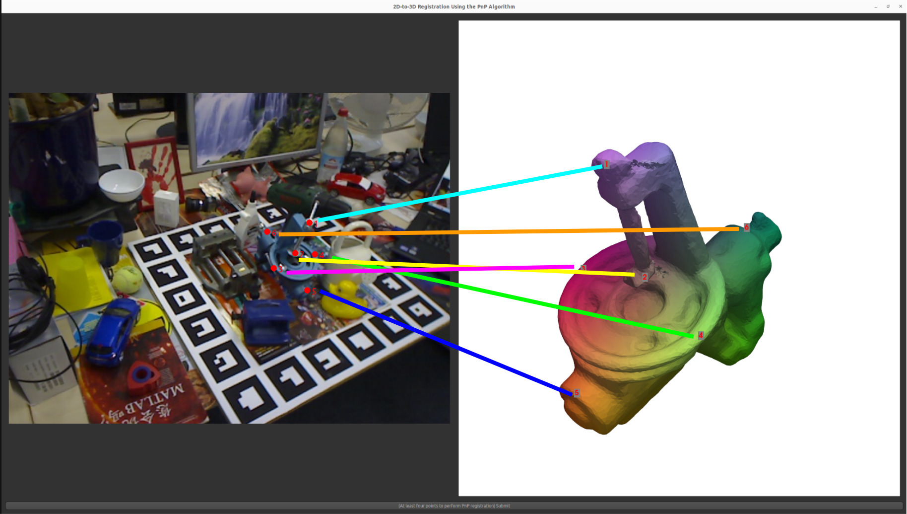
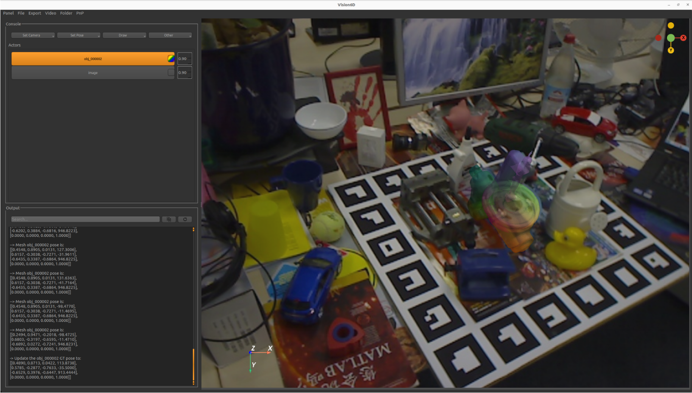
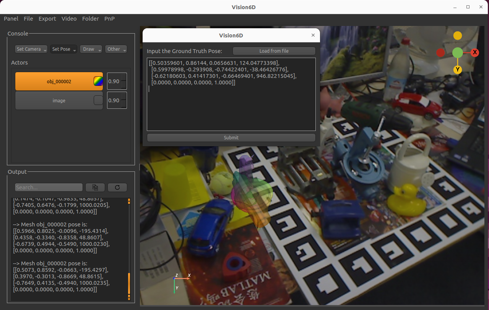
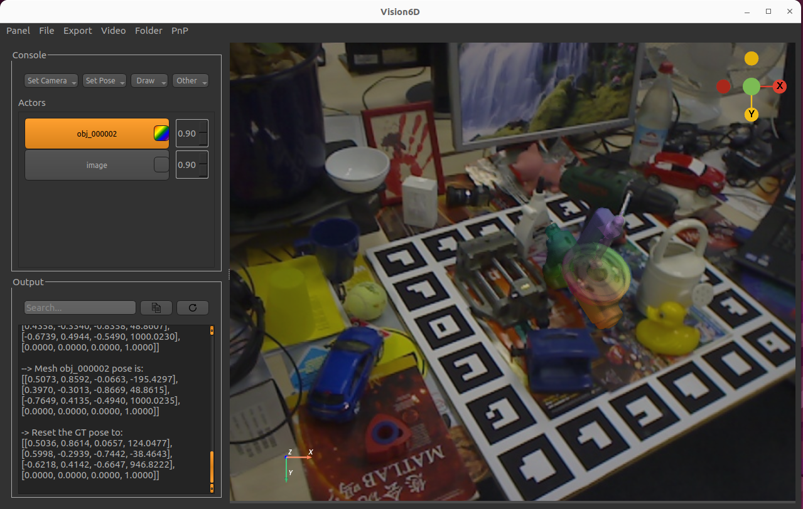
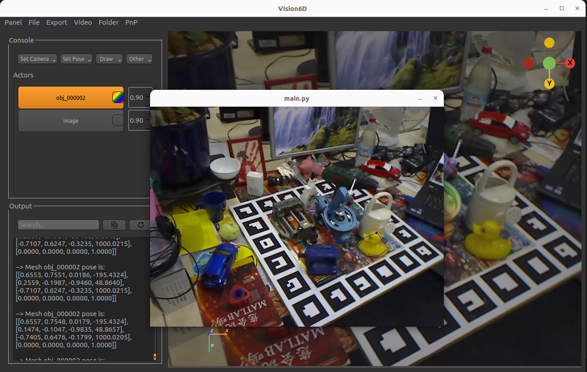
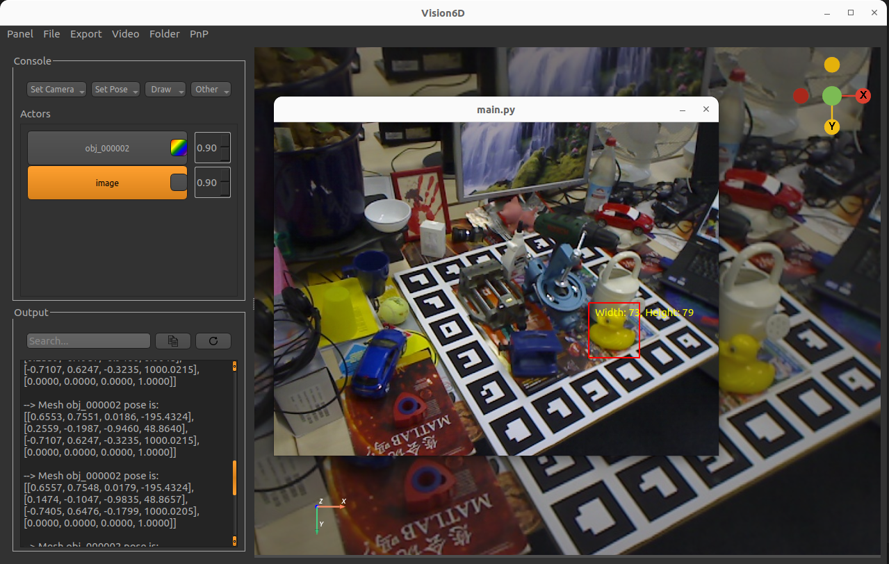
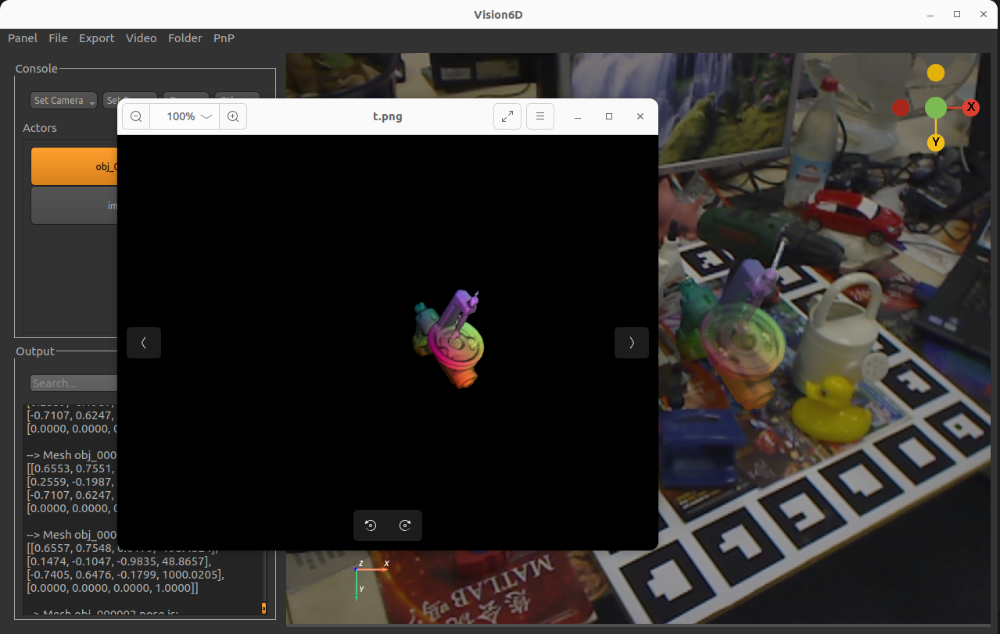

<h1 align="center">
  <br>
  <a href=""></a>
  <br>
  VISION6D
  <br>
</h1>

<h4 align="center">VISION6D: 3D-to-2D visualization and annotation tool for 6D pose estimation desktop app. This python-based application is designed to work on Windows and Linux (Ubuntu-tested).</h4>

<p align="center">
  <a href="https://github.com/InteractiveGL/vision6D/releases">
    
  </a>
  <!-- <a href="https://github.com/InteractiveGL/vision6D/blob/main/LICENSE">
    
  </a> -->
  <a href="https://github.com/InteractiveGL/vision6D/blob/main/LICENSE">
    
  </a>
  <a href="https://github.com/InteractiveGL/vision6D/">
    
  </a>
  <a href="https://github.com/InteractiveGL/vision6D/graphs/contributors">
    
  </a>
  <a href="https://github.com/InteractiveGL/vision6D">
    
  </a>
</p>

<p align="center">
  <a href="#key-features">Key Features</a> •
  <a href="#how-to-use">How To Use</a> •
  <a href="#examples">Examples</a> •
  <a href="#download">Download</a> •
  <a href="#emailware">Emailware</a> •
  <a href="#credits">Credits</a> •
  <a href="#license">License</a>
</p>


## Key Features

* LivePreview - Make changes, See changes
  - Instantly see what your pose annotation in Vision6D as you move the 3D objects!
* Provide built-in [NOCS](https://arxiv.org/abs/1901.02970) color representation for the 3D meshes
  - color the meshes with NOCS.
* Load the textures for the 3D meshes
  - color the meshes with their own textures.
* Segmentation Mask/Bounding Box Drawing
  - create a segmentation mask in Vision6D on top of the provided 2D image.
* Real-time rendering results
  - renders the annotated results.
* Cross platform
  - Windows and Linux (Ubuntu-tested) ready (highly recommend to use with a mouse).

## How To Use

To clone and run this application, you'll need [Git](https://git-scm.com) and [Node.js](https://nodejs.org/en/download/) (which comes with [npm](http://npmjs.com)) installed on your computer. From your command line:

```bash
# (Optional) Create a conda environment
$ conda create -n vision6D python=3.10

# Clone this repository
$ git clone https://github.com/InteractiveGL/vision6D.git

# Go into the repository
$ cd vision6D

# Install dependencies
$ pip install .

# Run the app
$ Vision6D
```

## Examples
Note that when fisrt load the application, it may take some time. Once it load successfully, the interactive experience will be smooth.

**PnP resgitration of the benchvise**
<p float="left">
  
  
</p>

**Set a ground-truth pose for visualization of the benchvise (ground-truth pose is obtained from the public 6D pose dataset Linemod)**
<p float="left">
  
  
</p>

**Free-hand registration of the benchvise**
<p>
  
</p>

**Draw a segmentation mask on the duck in this scene**
<p float="left">
  
  
</p>

**Draw a bounding box around the duck in this scene**
<p float="left">
  
  
</p>

**Render the benchwise mesh**
<p float="left">
  
  
</p>

## Download

You can [download](https://github.com/InteractiveGL/vision6D/releases/tag/0.3.9) the latest installable version of Vision6D for Windows, macOS and Linux.

## Emailware

Vision6D is an [emailware](https://en.wiktionary.org/wiki/emailware). Meaning, if you liked using this app or it has helped you in any way, I'd like you send me an email at <yike.zhang@vanderbilt.edu> about anything you'd want to say about this software. I'd really appreciate it! Alternatively, you can also submit an issue regarding using this software, I'll answer it as soon as I see it!

## Credits

This software uses the following open source packages:

- [Pyvista](https://docs.pyvista.org)
- [VTK](https://vtk.org/)
- [PyQt5](https://www.riverbankcomputing.com/static/Docs/PyQt5/)
- [pyvistaqt](https://github.com/pyvista/pyvistaqt)
- [NumPy](https://numpy.org/)

## License

GNU

---