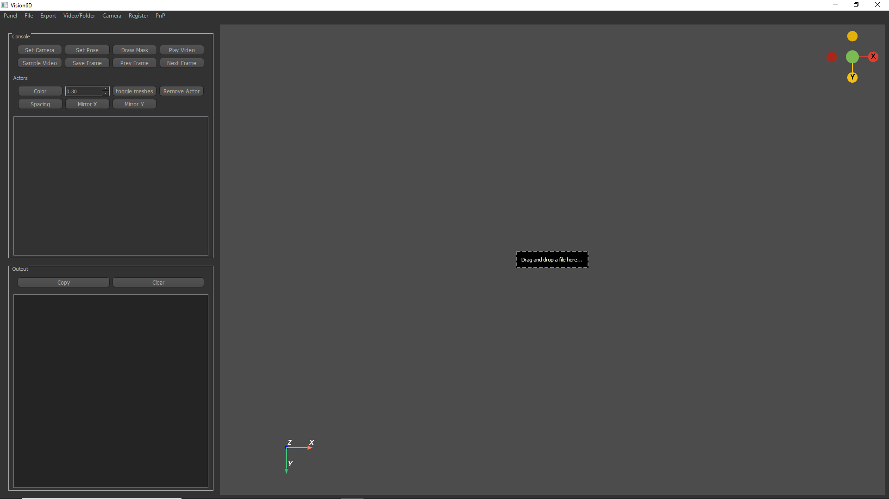
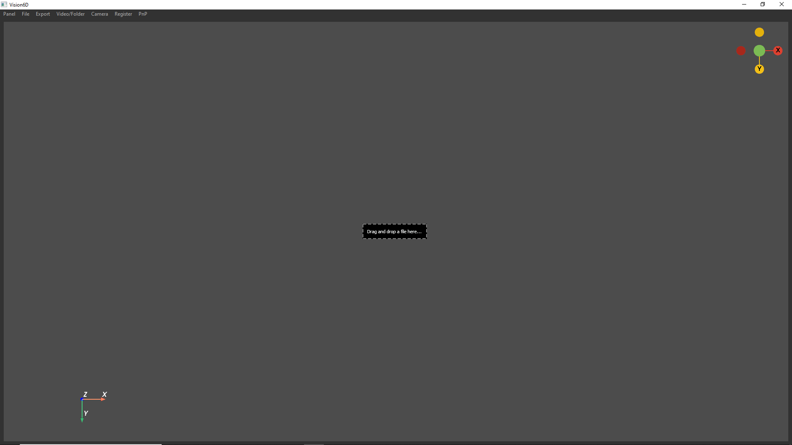
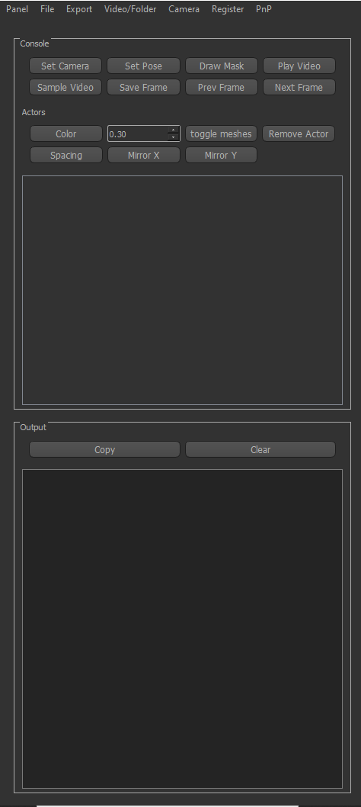
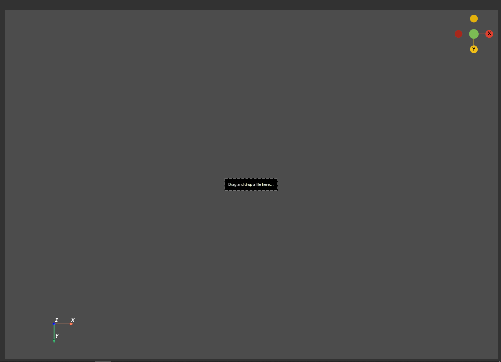

🎯 GUI
==================================================

The GUI(Graphic User Interface) consists of three parts: app menu, display panel and user interactive elements.

App Layout
--------------------------------------------------

Overall view
~~~~~~~~~~~~~~~~~~~~~~~~~~~~~~~~~~~~~~~~~~~~~~~~~~

The app has two main widgets, the left widget and the right widget. The left widget can be fold or unfold based on users' perference.

**Left widget unfold**

**Left widget fold**

Click the "Panel" button to fold and unfold the left widget.

Left widget view
~~~~~~~~~~~~~~~~~~~~~~~~~~~~~~~~~~~~~~~~~~~~~~~~~~

The top of the left widget is the app manu. The block below the menu consists of "Console", which are the functional buttons, and "Actors", which perform actions to all actors in the interactive plot. The bottom block consists of all the output from the program.

Right widget view
~~~~~~~~~~~~~~~~~~~~~~~~~~~~~~~~~~~~~~~~~~~~~~~~~~

This is an interactive plot, and user can move the camera or move the targets in the plot. Additionally, users can drag and drop files in the right widget.

Shortcuts
--------------------------------------------------